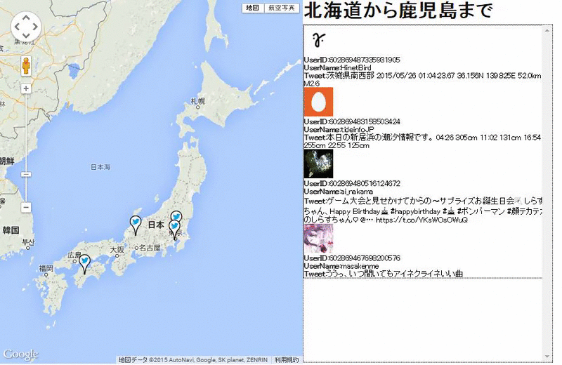

# TwitterMap

node.js

socket.io

TwitterAPI1.1

GoogleMapsAPIv3



# Requirements
* node.js >= v0.12.x
* npm >= v1.4.x

Please install this libraries.
```
npm install ntwitter
```

```
npm install socket.io
```

```
npm install express
```

# Usage

How to use this application?

```
node server.js
```

Access following a local loopback address.

localhost:5000 or 127.0.0.1:5000


# Environment
This library tested on
- Google Chrome 42
- Mozilla Firefox 38
- IE11


# Author
Fumihiko Akagi

# Copyright

Copyright (c) 2014 Fumihiko Akagi
